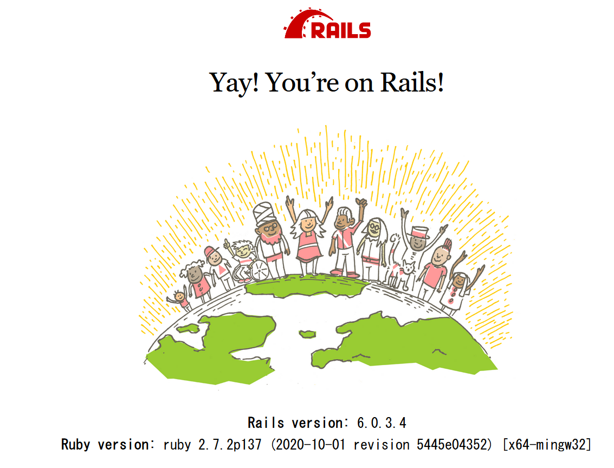
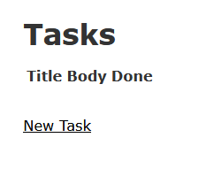

# learn rails6

## 1. env

```powershell
PS > ruby -v
ruby 2.7.2p137 (2020-10-01 revision 5445e04352) [x64-mingw32]
PS > rails -v
Rails 6.0.3.4

SQLite
```


## 2. rails new

```powershell
PS > rails new learn-rails6
PS > cd learn-rails6
PS learn-rails6>
```

full log: [rails-new.log](rails-new.log)  

## 3. rails s

```powershell
PS learn-rails6> rails s
```

browser: http://localhost:3000/  


  

## 4 todo

### 4.1 rails generate scaffold task title:string body:text done:boolean

```powershell
PS learn-rails6> rails generate scaffold task title:string body:text done:boolean
      invoke  active_record
      create    db/migrate/20201020060128_create_tasks.rb
      create    app/models/task.rb
      invoke    test_unit
      create      test/models/task_test.rb
      create      test/fixtures/tasks.yml
      invoke  resource_route
       route    resources :tasks
      invoke  scaffold_controller
      create    app/controllers/tasks_controller.rb
      invoke    erb
      create      app/views/tasks
      create      app/views/tasks/index.html.erb
      create      app/views/tasks/edit.html.erb
      create      app/views/tasks/show.html.erb
      create      app/views/tasks/new.html.erb
      create      app/views/tasks/_form.html.erb
      invoke    test_unit
      create      test/controllers/tasks_controller_test.rb
      create      test/system/tasks_test.rb
      invoke    helper
      create      app/helpers/tasks_helper.rb
      invoke      test_unit
      invoke    jbuilder
      create      app/views/tasks/index.json.jbuilder
      create      app/views/tasks/show.json.jbuilder
      create      app/views/tasks/_task.json.jbuilder
      invoke  assets
      invoke    scss
      create      app/assets/stylesheets/tasks.scss
      invoke  scss
      create    app/assets/stylesheets/scaffolds.scss
```

### 4.2 rake db:migrate

```powershell
learn-rails6> rake db:migrate
== 20201020060128 CreateTasks: migrating ======================================
-- create_table(:tasks)
   -> 0.0038s
== 20201020060128 CreateTasks: migrated (0.0046s) =============================
```

### 4.3 rails s

```powershell
PS learn-rails6> rails s
```

browser: http://localhost:3000/tasks  

  


